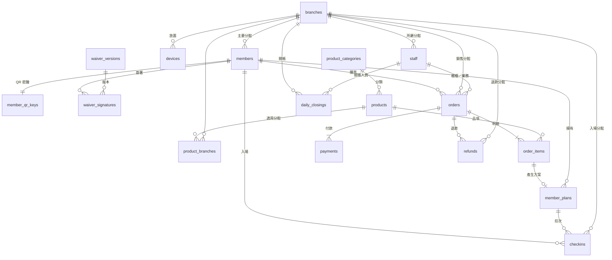

# 原岩攀岩館 資料庫設計

> 版本：v0.3（已建立資料庫指令檔 `supabase/migrations/`，2026-09-28）
> 資料庫：Supabase（PostgreSQL + Auth + Row Level Security）
> 本文件只描述「資料要怎麼存」，尚未包含任何程式碼。

---

## 0. 總覽

### 0.1 資料表一覽

| 分組 | 資料表 | 用途 |
|---|---|---|
| 組織 | `branches` | 分館 |
| 組織 | `staff` | 員工與角色 |
| 組織 | `devices` | 入場機、櫃檯平板等裝置 |
| 組織 | `holidays` | 國定假日（「假日」方案可用的日子） |
| 會員 | `members` | 會員基本資料 |
| 會員 | `member_qr_keys` | 產生 30 秒 QR code 用的密鑰（獨立存放，任何畫面都讀不到） |
| 同意書 | `waiver_versions` | 同意書版本與全文 |
| 同意書 | `waiver_signatures` | 誰、何時、在哪簽了哪一版 |
| 品項 | `product_categories` | 品項分類（櫃檯按鈕格子的顏色） |
| 品項 | `products` | 可販售的品項 |
| 品項 | `product_branches` | 品項適用／販售的分館 |
| 方案 | `member_plans` | 會員買到的方案（剩幾次、到哪天） |
| 銷售 | `orders` | 訂單（一次結帳 = 一張訂單） |
| 銷售 | `order_items` | 訂單明細（當下品名、單價） |
| 銷售 | `payments` | 付款紀錄（現金／LINE Pay） |
| 銷售 | `refunds` | 退款紀錄（記在退款當天的帳上） |
| 營運 | `checkins` | 入場紀錄（成功或被擋下都記） |
| 營運 | `daily_closings` | 每日關帳 |
| 稽核 | `audit_logs` | 重要異動紀錄（改價、改手機、退款、關帳後修改訂單等） |

### 0.2 關係圖

### 0.3 共通慣例

- **主鍵**：全部使用 `uuid`（`id uuid primary key default gen_random_uuid()`）。
- **時間**：一律 `timestamptz`（含時區），畫面顯示時轉成台灣時間（Asia/Taipei）。
- **營業日**：`business_date date`，就是台灣時間的日曆日期，用來對應「哪一天的關帳」。各館最晚營業到 23:00，所以不需要「跨夜算前一天」；萬一凌晨有交易，就算在當天（新的那一天）。
- **金額**：新台幣整數（`integer`，單位：元），不存小數。
- **每張表都有** `created_at`、`updated_at`（由資料庫自動填寫）。
- **不刪除原則**：品項、會員、訂單、入場紀錄、簽署紀錄都不做實體刪除，改用「狀態」欄位（下架、停用、作廢）。
- **不收集**：身分證字號、病史或任何健康資料。
- **手機號碼格式**：統一存成國際格式 `+8869XXXXXXXX`，避免 `0912…` 與 `+886912…` 被當成兩個人。

---

## 1. 組織

### 1.1 `branches` 分館

| 欄位 | 型別 | 必填 | 說明 |
|---|---|---|---|
| id | uuid | ✔ | 主鍵 |
| code | text | ✔ | 分館代碼，唯一，例如 `TPE`、`TCH`（用在訂單編號） |
| name | text | ✔ | 分館名稱，例如「原岩 台北萬華館」 |
| address | text | | 地址 |
| phone | text | | 分館電話 |
| sort_order | integer | ✔ | 顯示順序 |
| is_active | boolean | ✔ | 是否營運中（停業分館設 false，資料保留） |

### 1.2 `staff` 員工

| 欄位 | 型別 | 必填 | 說明 |
|---|---|---|---|
| id | uuid | ✔ | 主鍵 |
| auth_user_id | uuid | | 對應 Supabase 登入帳號（`auth.users.id`），唯一；依 Email 自動連結 |
| name | text | ✔ | 姓名 |
| email | text | ✔ | 登入用 Email，唯一 |
| phone | text | | 聯絡電話 |
| role | enum | ✔ | `hq` 總部／`manager` 店長／`cashier` 櫃檯 |
| branch_id | uuid → branches | | 所屬分館；**總部可為空**，店長與櫃檯必填 |
| status | enum | ✔ | `active` 在職／`disabled` 停用（離職不刪除，保留經手紀錄） |

- 規則：`role in ('manager','cashier')` 時 `branch_id` 不可為空。
- 員工停用後立即無法登入，但過去的訂單、入場、關帳紀錄仍會顯示他的名字。

### 1.3 `devices` 裝置

入場機需要「一直登入著」自己運作，所以每台入場機是一個獨立的裝置帳號，而不是某個員工的帳號。

| 欄位 | 型別 | 必填 | 說明 |
|---|---|---|---|
| id | uuid | ✔ | 主鍵 |
| auth_user_id | uuid | | 裝置專用登入帳號；依 Email 自動連結 |
| email | text | ✔ | 裝置登入用 Email，唯一 |
| branch_id | uuid → branches | ✔ | 放在哪個分館 |
| name | text | ✔ | 例如「萬華館 入場機 1」 |
| type | enum | ✔ | `kiosk` 入場機／`counter` 櫃檯平板 |
| status | enum | ✔ | `active`／`disabled`（平板遺失時立即停用） |
| last_seen_at | timestamptz | | 最後連線時間（方便知道哪台機器離線） |

- 入場機帳號**只能**呼叫「驗證 QR 並入場」這一個功能，不能讀會員名單或任何其他資料（例外：可讀取會員大頭照，顯示在入場成功畫面）。

### 1.4 `holidays` 國定假日

| 欄位 | 型別 | 必填 | 說明 |
|---|---|---|---|
| date | date | ✔ | 日期（主鍵） |
| name | text | ✔ | 名稱，例如「國慶日」 |

- 「假日」＝ 週六、週日，加上這張表列出的日子；「平日」＝ 其他日子。
- 由總部每年輸入一次。

---

## 2. 會員

### 2.1 `members` 會員

| 欄位 | 型別 | 必填 | 說明 |
|---|---|---|---|
| id | uuid | ✔ | 主鍵 |
| member_no | text | ✔ | 會員編號，唯一，給人看的（例如 `M000123`） |
| auth_user_id | uuid | | 會員 App 登入帳號；會員第一次用簡訊登入後才綁定，櫃檯代為註冊時可先為空 |
| phone | text | ✔ | 手機號碼，**唯一**，簡訊登入用。**只有總部能修改**（櫃檯、店長、會員本人都不能改），因為它等於登入帳號 |
| name | text | ✔ | 姓名 |
| birthday | date | ✔ | 生日（用來判斷是否未成年，需法定代理人簽同意書） |
| avatar_path | text | | 大頭照在 Supabase Storage 的路徑（私有空間，不公開網址） |
| emergency_name | text | ✔ | 緊急聯絡人姓名 |
| emergency_phone | text | ✔ | 緊急聯絡人電話 |
| emergency_relation | text | ✔ | 與會員關係（例如：父母、配偶、朋友） |
| carrier_code | text | | 手機條碼載具（格式：`/` 開頭共 8 碼），結帳時自動帶入 |
| email | text | | 選填 |
| home_branch_id | uuid → branches | ✔ | 主要分館 |
| status | enum | ✔ | `active` 正常／`suspended` 暫停（例如違規，入場會被擋）／`inactive` 停用（本人要求停用） |
| staff_note | text | | 櫃檯備註，**只有員工看得到，會員 App 看不到** |
| legacy_17fit_id | text | | 17FIT 會員編號，唯一，資料搬家與對帳用 |
| marketing_opt_in | boolean | ✔ | 是否同意接收行銷訊息，預設 false |
| marketing_opt_in_at | timestamptz | | 最後一次變更行銷同意的時間（個資法佐證） |
| created_by_staff_id | uuid → staff | | 由哪位櫃檯建立；會員自行註冊則為空 |

- 索引：`phone`（唯一）、`name`（櫃檯模糊搜尋）、`legacy_17fit_id`（唯一）、`member_no`（唯一）。
- 12,000 名會員對 Postgres 來說是很小的量，查詢都會在瞬間完成。
- **沒有**身分證字號、病史欄位。

### 2.2 `member_qr_keys` 會員 QR 密鑰

入場 QR code 每 30 秒更新一次，原理和銀行 App 的動態密碼一樣：手機和伺服器共用一把密鑰，依「現在時間」算出同一組碼。

| 欄位 | 型別 | 必填 | 說明 |
|---|---|---|---|
| member_id | uuid → members | ✔ | 主鍵，一位會員一把 |
| secret | bytea | ✔ | 密鑰（20 位元組隨機值） |
| last_used_step | bigint | ✔ | 最後一次成功入場用的時間格（防止同一個碼被別人再用一次） |
| rotated_at | timestamptz | ✔ | 上次更換時間（換手機或疑似外流時可重發，舊 QR 立即失效） |

- 這張表放在內部 schema `app`，**任何人都不能直接讀取**；會員 App 只能透過 `get_my_qr_secret()` 取得自己的密鑰，好在沒網路時也能自己算出 QR。
- QR 內容格式：`OY1.<會員編號>.<8 位數動態碼>`（TOTP 標準，SHA1、30 秒）。
- 同一個碼只能成功入場一次；90 秒內在同一館重複刷，會直接回覆「成功」但不重複記錄。
- 總部改會員手機時，密鑰會自動重發。
- 截圖分享給別人的 QR code 30 秒後就失效，避免借卡入場。

---

## 3. 同意書

### 3.1 `waiver_versions` 同意書版本

| 欄位 | 型別 | 必填 | 說明 |
|---|---|---|---|
| id | uuid | ✔ | 主鍵 |
| version | text | ✔ | 版本號，唯一，例如 `2026.1` |
| title | text | ✔ | 標題，例如「攀岩運動風險告知暨免責同意書」 |
| content | text | ✔ | 同意書全文 |
| effective_date | date | ✔ | 生效日 |
| created_by | uuid → staff | ✔ | 建立者（總部） |

- **目前有效版本** ＝ 生效日 ≤ 今天之中，生效日最新的那一版。
- 版本一旦有人簽過，**全文就不能再修改**（要改就發新版本），確保「會員簽的內容」永遠查得到原文。

### 3.2 `waiver_signatures` 簽署紀錄

| 欄位 | 型別 | 必填 | 說明 |
|---|---|---|---|
| id | uuid | ✔ | 主鍵 |
| member_id | uuid → members | ✔ | 簽署的會員 |
| waiver_version_id | uuid → waiver_versions | ✔ | 簽的是哪一版 |
| signed_at | timestamptz | ✔ | 簽署時間 |
| branch_id | uuid → branches | | 在哪個分館簽（會員在 App 上自己簽則可為空） |
| method | enum | ✔ | `counter` 櫃檯平板／`app` 會員 App／`paper` 紙本掃描補登 |
| signature_path | text | ✔ | 手寫簽名圖檔在 Storage 的路徑（私有） |
| is_minor | boolean | ✔ | 簽署當下是否未成年（依生日自動計算並記下來） |
| guardian_name | text | | 法定代理人姓名（未成年必填） |
| guardian_phone | text | | 法定代理人電話（未成年必填） |
| guardian_relation | text | | 法定代理人關係（未成年必填，例如：父、母、監護人） |
| staff_id | uuid → staff | | 協助簽署的櫃檯人員 |

- 規則：`is_minor = true` 時，法定代理人三個欄位都必填，簽名圖為法定代理人的簽名。
- 簽署紀錄**不可修改、不可刪除**（法律證據）。
- 入場時檢查：會員是否簽過「目前有效版本」，沒有就擋下並顯示「需簽同意書」。

---

## 4. 品項

### 4.1 `product_categories` 品項分類

| 欄位 | 型別 | 必填 | 說明 |
|---|---|---|---|
| id | uuid | ✔ | 主鍵 |
| name | text | ✔ | 名稱，例如「入場」「票券」「課程」「租借」 |
| bg_color | text | ✔ | 櫃檯按鈕格子底色，例如 `#1F6F5C` |
| text_color | text | ✔ | 文字顏色，例如 `#FFFFFF` |
| sort_order | integer | ✔ | 排序（數字小的在前） |
| is_active | boolean | ✔ | 是否顯示 |

### 4.2 `products` 品項

| 欄位 | 型別 | 必填 | 說明 |
|---|---|---|---|
| id | uuid | ✔ | 主鍵 |
| name | text | ✔ | 品名，例如「單次入場（平日）」「十次券」「月票」 |
| category_id | uuid → product_categories | ✔ | 分類 |
| price | integer | ✔ | 售價（元），≥ 0 |
| content_type | enum | ✔ | 內容類型，見下表 |
| quantity | integer | ✔ | 數量：次數、天數或堂數，見下表 |
| valid_days | integer | | 次數／堂數型的使用期限（購買後幾天內要用完）；**空白 = 不限期**。目前十次券不限期，欄位先保留以備日後需要 |
| usage_rule | enum | ✔ | 哪幾天可用：`any` 不限／`weekday` 平日／`weekend` 假日／`time_slot` 不限日期但限時段 |
| slot_start | time | | 時段開始（選填，可搭配平日／假日，例如平日白天票 = `weekday` + `12:00～18:00`；`time_slot` 時必填） |
| slot_end | time | | 時段結束（例如 `17:00`） |
| all_branches | boolean | ✔ | true = 所有分館適用；false = 看 `product_branches` |
| sort_order | integer | ✔ | 櫃檯畫面上的排序 |
| sale_start | date | | 上架開始日（選填，限時優惠用） |
| sale_end | date | | 上架結束日（選填） |
| status | enum | ✔ | `on_sale` 上架／`off_sale` 下架 |

**內容類型（content_type）與數量（quantity）**

| content_type | 中文 | quantity 意思 | 結帳後 | 例子 |
|---|---|---|---|---|
| `single` | 單次 | 固定 1 | 產生一個 1 次的方案，當日有效 | 單次入場 |
| `punch` | 次數 | 可入場次數 | 產生 N 次方案 | 十次券（quantity=10） |
| `days` | 天數 | 有效天數 | 產生 N 天內無限次入場的方案 | 月票（quantity=30） |
| `course` | 課程堂數 | 堂數 | 產生 N 堂課的方案 | 初階課程 4 堂 |
| `rental` | 租借 | 固定 1 | **不產生方案**，只是銷售 | 岩鞋租借、粉袋租借 |

- **品項不可刪除**：資料庫層直接禁止 DELETE，只能改 `status` 上架／下架。
- 櫃檯看到的品項 = `status = on_sale`，且今天在 `sale_start`～`sale_end` 之間，且適用該分館。
- 改價只影響之後的訂單（舊訂單明細有自己的價格快照，見 6.2）。

### 4.3 `product_branches` 品項適用分館

| 欄位 | 型別 | 必填 | 說明 |
|---|---|---|---|
| product_id | uuid → products | ✔ | 品項 |
| branch_id | uuid → branches | ✔ | 分館 |

- 主鍵：(`product_id`, `branch_id`)。
- 只有在 `products.all_branches = false` 時才需要填。
- 同一份清單同時代表「哪些分館可以賣」與「買到的方案可以在哪些分館使用」。

---

## 5. 會員方案

### 5.1 `member_plans` 會員方案

會員每買一個可入場／上課的品項，就產生一筆方案。

| 欄位 | 型別 | 必填 | 說明 |
|---|---|---|---|
| id | uuid | ✔ | 主鍵 |
| member_id | uuid → members | ✔ | 擁有者 |
| product_id | uuid → products | ✔ | 從哪個品項來 |
| order_item_id | uuid → order_items | | 從哪一筆訂單明細產生；17FIT 搬過來的舊方案可為空 |
| name | text | ✔ | 方案名稱（購買當下品名快照） |
| content_type | enum | ✔ | 同品項：`single`／`punch`／`days`／`course` |
| total_count | integer | | 總次數／堂數（天數型為空） |
| remaining_count | integer | | 剩餘次數／堂數（天數型為空），不可小於 0 |
| start_date | date | | 起始日 |
| end_date | date | | 到期日（含當天） |
| usage_rule | enum | ✔ | 購買當下的適用條件快照 |
| slot_start / slot_end | time | | 時段快照 |
| branch_ids | uuid[] | | 適用分館快照；空白 = 所有分館 |
| status | enum | ✔ | `active` 使用中／`used_up` 已用完／`expired` 已過期／`frozen` 暫停（例如受傷請假）／`cancelled` 已取消（退費） |
| note | text | | 備註（例如：17FIT 移轉、補償贈送） |

- **為什麼要把品名、條件、分館「複製」一份到方案裡？** 因為之後品項改規則，已經賣出的方案不應該跟著變。會員買的時候是「平日可用」，就一直是平日可用。
**起訖日期怎麼算**

| 類型 | start_date | end_date |
|---|---|---|
| `single` 單次 | 購買當天 | 購買當天 |
| `punch` 次數（十次券） | 購買當天 | 品項有 `valid_days` 才計算；目前**空白 = 不限期** |
| `days` 天數（月票） | **購買當天** | 購買當天 + 天數 − 1（例：9/28 買 30 天月票，用到 10/27） |
| `course` 課程 | 購買當天 | 同次數型 |

**扣次規則**

- 次數型（十次券、單次）**一天只扣一次**：當天第一次入場扣 1 次，同一天之後再進場（出去吃飯再回來、或到其他適用分館）都不再扣。
- `days` 天數型在有效期間內無限次入場，不扣次。
- 同一會員有多個可用方案時，入場機**優先使用最快到期的那一個**；當天已經扣過次的方案優先沿用。
- **課程**方案不會被入場機自動使用；上課時由櫃檯指定課程方案入場，每堂扣 1 次。

---

## 6. 銷售

### 6.1 `orders` 訂單

| 欄位 | 型別 | 必填 | 說明 |
|---|---|---|---|
| id | uuid | ✔ | 主鍵 |
| order_no | text | ✔ | 訂單編號，唯一，例如 `TPE-20260928-0012`（分館代碼-日期-流水號） |
| branch_id | uuid → branches | ✔ | 銷售分館 |
| business_date | date | ✔ | 營業日（決定歸屬哪一天的關帳） |
| member_id | uuid → members | | 購買會員（租借等可不綁會員） |
| cashier_staff_id | uuid → staff | ✔ | 結帳的櫃檯人員 |
| sales_staff_id | uuid → staff | | 業務代表（業績歸屬，可與櫃檯不同人） |
| subtotal | integer | ✔ | 原價小計（明細加總） |
| discount_amount | integer | ✔ | 整單折扣金額，預設 0 |
| discount_reason | text | | 折扣原因（例如：學生優惠、員工親友） |
| total | integer | ✔ | 應收金額 = subtotal − discount_amount，≥ 0 |
| invoice_type | enum | ✔ | `carrier` 手機載具／`print` 列印紙本 |
| invoice_carrier | text | | 結帳當下使用的載具號碼（快照） |
| invoice_tax_id | text | | 買方統編（公司報帳用，選填） |
| invoice_no | text | | 發票號碼（之後串接電子發票平台時填入） |
| note | text | | 訂單備註 |
| status | enum | ✔ | `paid` 已付款／`voided` 作廢／`refunded` 已退款 |
| voided_by | uuid → staff | | 作廢／退款人員 |
| voided_at | timestamptz | | 作廢／退款時間 |
| void_reason | text | | 作廢／退款原因 |

- 訂單不刪除。兩種取消方式：
  - **作廢**：當天、尚未關帳、打錯單時使用，這筆訂單視同沒發生。
  - **退款**：錢要退還給客人時使用，退款金額記在「退款那一天」的帳上（見 6.4 `refunds`），不會去改動已關帳那天的帳。
- 作廢或退款時，一併把這張訂單產生的會員方案設為 `cancelled`。

### 6.2 `order_items` 訂單明細

| 欄位 | 型別 | 必填 | 說明 |
|---|---|---|---|
| id | uuid | ✔ | 主鍵 |
| order_id | uuid → orders | ✔ | 所屬訂單 |
| product_id | uuid → products | ✔ | 品項 |
| product_name | text | ✔ | **當下品名快照** |
| unit_price | integer | ✔ | **當下單價快照** |
| quantity | integer | ✔ | 數量，≥ 1 |
| discount_amount | integer | ✔ | 此行折扣，預設 0 |
| line_total | integer | ✔ | 小計 = unit_price × quantity − discount_amount |

- 之後品項改名或改價，舊訂單的明細**完全不受影響**，報表永遠對得起來。
- 買 2 張十次券 → `quantity = 2`，產生 2 筆會員方案。

### 6.3 `payments` 付款

一張訂單可以有多筆付款（例如一部分現金、一部分 LINE Pay）。

| 欄位 | 型別 | 必填 | 說明 |
|---|---|---|---|
| id | uuid | ✔ | 主鍵 |
| order_id | uuid → orders | ✔ | 所屬訂單 |
| method | enum | ✔ | `cash` 現金／`line_pay` LINE Pay |
| amount | integer | ✔ | 此筆金額 |
| cash_received | integer | | 現金：客人給多少 |
| cash_change | integer | | 現金：找零多少 |
| line_pay_transaction_id | text | | LINE Pay 交易序號（對帳用） |
| status | enum | ✔ | `completed` 完成（退款另記在 `refunds`，這裡不改） |
| paid_at | timestamptz | ✔ | 付款時間 |

- 規則：同一訂單所有 `completed` 付款加總 = `orders.total`。

### 6.4 `refunds` 退款

| 欄位 | 型別 | 必填 | 說明 |
|---|---|---|---|
| id | uuid | ✔ | 主鍵 |
| order_id | uuid → orders | ✔ | 退哪一張訂單 |
| branch_id | uuid → branches | ✔ | 在哪個分館辦理退款 |
| business_date | date | ✔ | 退款當天（算在這天的關帳裡） |
| method | enum | ✔ | `cash` 現金／`line_pay` LINE Pay |
| amount | integer | ✔ | 退款金額，> 0 |
| line_pay_refund_id | text | | LINE Pay 退款序號（對帳用） |
| reason | text | ✔ | 退款原因（必填） |
| staff_id | uuid → staff | ✔ | 辦理人員 |
| refunded_at | timestamptz | ✔ | 退款時間 |

- **櫃檯與店長都可以辦理退款**（限自己分館的訂單），總部可退任何分館。
- 畫面上按下「退款」後，**一定會跳出重複確認視窗**（顯示訂單編號、會員、金額、退款方式），要再按一次「確認退款」才會執行。作廢也一樣。
- 退款與「把方案設為取消、訂單改為已退款」在同一個交易裡完成。
- 一張訂單的退款總額不能超過它的付款總額。
- 若會員的方案已經用過（例如十次券用了 3 次），系統仍允許退款，退多少由櫃檯輸入；每筆退款都會寫入 `audit_logs`。

### 6.5 結帳必須「一起成功或一起失敗」

結帳不是由畫面分別寫入三張表，而是呼叫資料庫裡**一個**「結帳」函式，在同一個交易（transaction）裡完成：

1. 重新讀取品項目前價格並檢查是否上架、是否適用此分館（不相信畫面傳來的價格）
2. 建立 `orders`
3. 建立 `order_items`（寫入品名、單價快照）
4. 建立 `payments`，並檢查付款總額 = 應收金額
5. 依品項產生 `member_plans`
6. 檢查當天是否已關帳（已關帳則櫃檯不能再結帳到這一天）

任何一步出錯（例如網路斷線、金額對不上），**全部取消**，不會出現「收了錢卻沒有方案」或「有方案卻沒有訂單」的狀況。

---

## 7. 入場

### 7.1 `checkins` 入場紀錄

成功入場和被擋下來的都記錄，方便日後查「為什麼我進不去」。

| 欄位 | 型別 | 必填 | 說明 |
|---|---|---|---|
| id | uuid | ✔ | 主鍵 |
| member_id | uuid → members | | 會員（QR 完全無法辨識時為空） |
| member_plan_id | uuid → member_plans | | 使用的方案（成功時必填） |
| branch_id | uuid → branches | ✔ | 入場分館 |
| checked_in_at | timestamptz | ✔ | 時間 |
| business_date | date | ✔ | 營業日（「今日入場」清單用） |
| method | enum | ✔ | `kiosk` 入場機／`counter` 櫃檯 |
| device_id | uuid → devices | | 哪台入場機 |
| staff_id | uuid → staff | | 經手人員（櫃檯手動入場時必填） |
| result | enum | ✔ | 見下表 |
| cancelled_at | timestamptz | | 櫃檯取消此筆入場（誤刷時退回次數） |
| deducted | boolean | ✔ | 這次入場有沒有扣次（一天只扣一次，取消時據此退回） |
| cancelled_by | uuid → staff | | 取消人員 |

**入場結果（result）**

| 值 | 入場機畫面 |
|---|---|
| `success` | 入場成功 |
| `qr_invalid` | QR 失效（過期、截圖、偽造） |
| `waiver_required` | 需簽同意書 |
| `no_valid_plan` | 沒有可用方案 |
| `plan_expired` | 方案到期 |
| `no_remaining` | 次數已用完 |
| `not_allowed_now` | 此方案現在不能用（平日票在假日、時段外） |
| `branch_not_allowed` | 此方案不適用本分館 |
| `member_suspended` | 會員暫停使用，請洽櫃檯 |

- 入場判斷也在資料庫的一個函式裡完成：驗證 QR → 檢查會員狀態 → 檢查同意書 → 挑選方案 → 扣次 → 寫紀錄，全部同一個交易。
- 一天只扣一次：同一會員同一營業日已經有 `success` 紀錄時，再次入場仍記一筆 `success`（方便知道進出幾次），但沿用同一個方案、**不再扣次**。

---

## 8. 關帳

### 8.1 `daily_closings` 關帳

| 欄位 | 型別 | 必填 | 說明 |
|---|---|---|---|
| id | uuid | ✔ | 主鍵 |
| branch_id | uuid → branches | ✔ | 分館 |
| business_date | date | ✔ | 營業日 |
| petty_cash | integer | ✔ | 零用金（開店時錢櫃裡的底錢） |
| cash_sales | integer | ✔ | 當日現金收入（系統計算） |
| line_pay_sales | integer | ✔ | 當日 LINE Pay 收入（系統計算，僅供參考） |
| cash_refunds | integer | ✔ | 當日現金退款（系統計算，來自 `refunds`） |
| expected_cash | integer | ✔ | 應有現金 = 零用金 + 現金收入 − 現金退款 |
| counted_cash | integer | ✔ | 實點金額（櫃檯實際點鈔） |
| difference | integer | ✔ | 差額 = 實點 − 應有（正數多錢，負數少錢） |
| difference_note | text | | 差額說明（差額不為 0 時必填） |
| closed_by | uuid → staff | ✔ | 關帳人員 |
| closed_at | timestamptz | ✔ | 關帳時間 |
| reopened_by | uuid → staff | | 重新開帳的店長／總部 |
| reopened_at | timestamptz | | 重新開帳時間 |

- 唯一：(`branch_id`, `business_date`) 一天只能有一筆關帳。
- **關帳後鎖定**：該分館該日的 `orders`、`order_items`、`payments`、`refunds` 只有店長以上能修改或作廢，櫃檯會被資料庫直接拒絕。每次修改都寫入 `audit_logs`。

---

## 9. 稽核

### 9.1 `audit_logs` 異動紀錄

| 欄位 | 型別 | 必填 | 說明 |
|---|---|---|---|
| id | bigint | ✔ | 主鍵（流水號） |
| occurred_at | timestamptz | ✔ | 時間 |
| staff_id | uuid → staff | | 誰做的 |
| action | text | ✔ | 例如 `product.price_changed`、`member.phone_changed`、`order.voided`、`order.refunded`、`order.edited_after_closing`、`closing.reopened` |
| table_name | text | ✔ | 哪張表 |
| record_id | uuid | ✔ | 哪一筆 |
| before | jsonb | | 修改前 |
| after | jsonb | | 修改後 |

- 只能新增，不能修改或刪除。只有總部與店長（限自己分館）可查閱。

---

## 10. 權限（RLS）

資料庫會依登入者身分自動過濾資料，就算有人繞過畫面直接連資料庫，也只能看到／改到他有權限的部分。

### 10.1 角色

| 角色 | 誰 |
|---|---|
| 總部 `hq` | 老闆、總部行政 |
| 店長 `manager` | 各分館店長 |
| 櫃檯 `cashier` | 各分館櫃檯人員 |
| 會員 `member` | 用簡訊登入 App 的會員 |
| 入場機 `kiosk` | 入場機裝置帳號 |

### 10.2 權限表

| 資料 | 總部 | 店長（限自己分館） | 櫃檯（限自己分館） | 會員 | 入場機 |
|---|---|---|---|---|---|
| 分館 | 全部管理 | 讀 | 讀 | 讀 | — |
| 員工 | 全部管理 | 讀自己分館；可管理自己分館的櫃檯 | 讀自己分館同事（選業務代表用） | — | — |
| 品項、分類 | 新增／修改／上下架 | 讀 | **只讀** | 讀上架中的 | — |
| 會員 | 全部（**唯一能改手機號碼的角色**） | 查詢、新增、修改（手機除外） | **查詢、新增** | 只看自己；改自己的 Email、緊急聯絡人等（手機除外） | — |
| 櫃檯備註 | 讀寫 | 讀寫 | 讀寫 | **看不到** | — |
| 同意書版本 | 管理 | 讀 | 讀 | 讀 | — |
| 簽署紀錄 | 讀 | 讀 | 新增（櫃檯簽署）、讀 | 讀自己、新增自己 | — |
| 會員方案 | 全部 | 讀、調整（例如暫停、補償） | 讀（透過結帳產生） | 讀自己 | — |
| 訂單／明細／付款 | 全部 | 讀、作廢、關帳後修改 | 建立（透過結帳函式）、讀、當日未關帳前作廢 | 讀自己 | — |
| 退款 | 全部 | 辦理、讀 | **辦理**、讀 | 讀自己 | — |
| 入場紀錄 | 全部 | 讀、取消 | 建立（櫃檯入場）、讀 | 讀自己 | 只能透過入場函式建立 |
| 關帳 | 全部 | 讀、重新開帳 | 建立（關帳）、讀 | — | — |
| 異動紀錄 | 讀 | 讀自己分館 | — | — | — |

- 會員資料是**全連鎖共用**：任何分館的櫃檯都能查到任何會員（會員可以到各館攀岩），但訂單、關帳、入場紀錄的「修改」權限限定在自己分館。
- 所有「刪除」一律不開放；需要取消的用狀態欄位處理。

---

## 11. 資料庫裡的功能（函式）

畫面不直接寫入重要資料表，而是呼叫以下功能；每個功能都在一個交易裡完成，並自己檢查身分。

| 功能 | 誰能用 | 做什麼 |
|---|---|---|
| `checkout(資料)` | 櫃檯、店長、總部 | 結帳：訂單＋明細＋付款＋會員方案 |
| `void_order(訂單, 原因)` | 櫃檯（限今天未關帳）、店長、總部 | 作廢 |
| `refund_order(訂單, 方式, 金額, 原因)` | 櫃檯、店長、總部 | 退款，記在今天 |
| `kiosk_checkin(QR 內容)` | 入場機 | 掃碼入場 |
| `counter_checkin(會員, 方案?)` | 櫃檯、店長、總部 | 櫃檯手動入場 |
| `cancel_checkin(入場紀錄)` | 店長、總部 | 取消誤刷，退回次數 |
| `closing_preview()` | 櫃檯、店長、總部 | 關帳前看今天應有多少錢 |
| `close_day(零用金, 實點, 說明?)` | 櫃檯（只能今天）、店長、總部 | 關帳 |
| `reopen_day(日期, 原因)` | 店長、總部 | 重新開帳 |
| `get_my_profile()`／`update_my_profile()`／`register_me()` | 會員 | 會員 App 讀寫自己的資料、自行註冊 |
| `get_my_qr_secret()` | 會員 | 取得 QR 密鑰 |

## 12. 17FIT 資料搬家（預留）

- `members.legacy_17fit_id` 記錄舊系統編號，匯入時用來比對，避免重複建立。
- 舊系統的剩餘方案匯入為 `member_plans`，`order_item_id` 留空，`note` 寫「17FIT 移轉」。
- 舊系統的同意書若是紙本，可用 `method = paper` 補登，或請會員第一次到館時重新簽署。

---

## 13. 老闆已確認的決定（2026-09-28）

| # | 問題 | 決定 |
|---|---|---|
| 1 | 同意書出新版後要重簽嗎？ | **要**。沒簽目前有效版本就不能入場 |
| 2 | 月票何時起算？ | **購買當天起算 30 天** |
| 3 | 十次券有期限嗎？ | **目前沒有期限**（`valid_days` 空白） |
| 4 | 櫃檯能改會員電話嗎？ | **不行，只有總部（最高權限）能改手機號碼**；會員本人也不能自己改 |
| 5 | 營業日怎麼切？ | 最晚營業到 23:00，**凌晨算當天（新的一天）**，即一般日曆日期 |
| 6 | 同一天再進場要再扣嗎？ | **套票一天只扣一次**，當天再進場不再扣 |
| 7 | 誰可以退款？ | **櫃檯和店長都可以**，畫面上要有**重複確認按鈕** |
